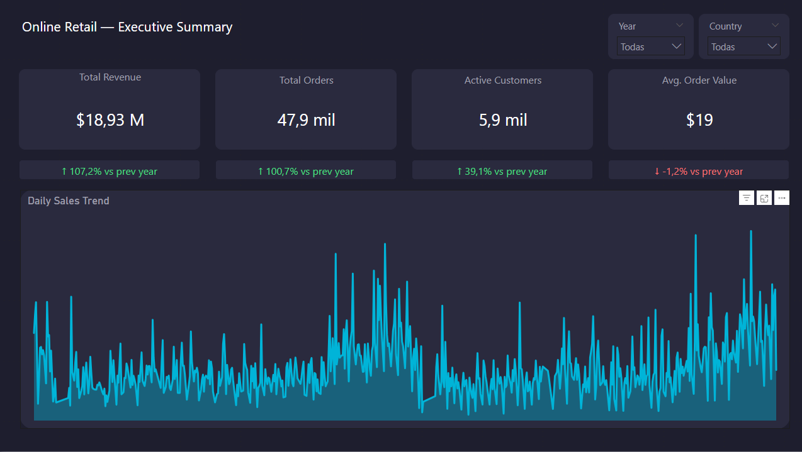
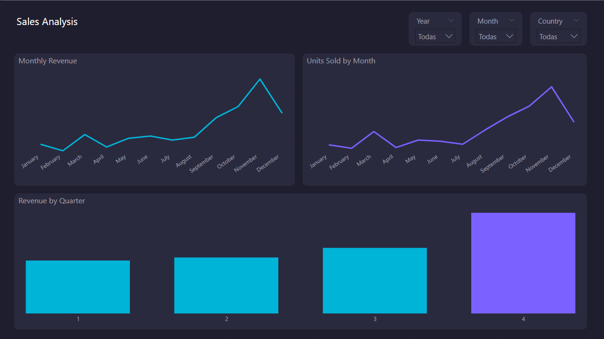
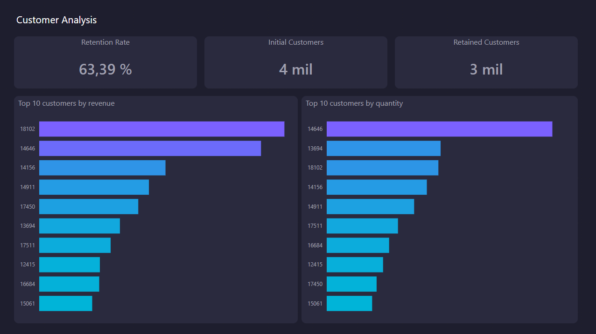
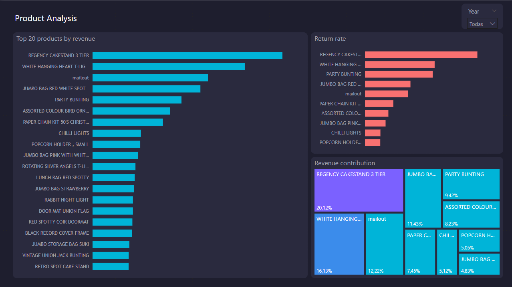
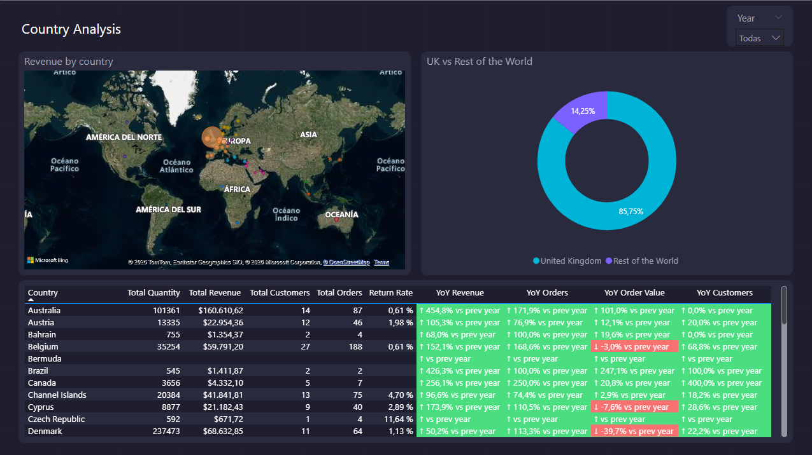
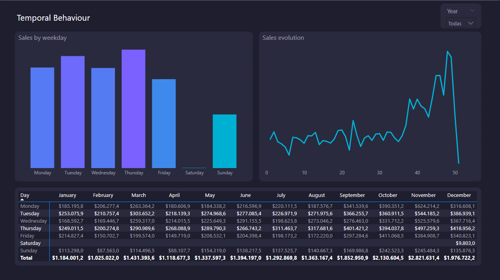

# Retail Sales Performance Analysis
### End-to-end data analytics project using the UCI Online Retail II dataset


---

## Overview

This project performs a full end-to-end sales performance analysis on the [UCI Online Retail II dataset](https://archive.ics.uci.edu/dataset/502/online+retail+ii), which contains transactional data for a UK-based online retailer between December 2009 and December 2011.

The project covers exploratory data analysis, data modeling with a star schema, an ETL pipeline, SQL-based analysis, and an interactive Power BI dashboard.

---

## Project Structure

```
retail-sales-performance/
│
├── assets/                   # Dashboard screenshots
│
├── data/
│   └── raw/                  # Original dataset files
│
├── notebooks/                # Jupyter notebooks for EDA
│
├── sql/                      # SQL queries for analysis
│
├── src/                      # ETL pipeline source code
│
├── main.py                   # Pipeline entry point
├── requirements.txt          # Python dependencies
├── Dashboard.pbix            # Power BI dashboard
├── ERD_Online_Retail.pdf     # Entity-relationship diagram
└── README.md
```

---

## Dataset

- **Source:** [UCI Machine Learning Repository — Online Retail II](https://archive.ics.uci.edu/dataset/502/online+retail+ii)
- **Period:** December 2009 – December 2011
- **Records:** ~1 million transactions
- **Features:** InvoiceNo, StockCode, Description, Quantity, InvoiceDate, UnitPrice, CustomerID, Country

---

## Tech Stack

| Layer | Tool |
|---|---|
| Data exploration | Python, Pandas, Jupyter Notebook |
| Data storage | SQL Server |
| ETL pipeline | Python (SQLAlchemy, Pandas) |
| Analysis | T-SQL |
| Visualization | Power BI (DirectQuery) |

---

## Architecture

The data model follows a **star schema** design:

```
                    dim_product
                        │
dim_country ── dim_customer ── fact_sales ── dim_date
```

**Tables:**
- `fact_sales` — transactional fact table (invoice, quantity, unit price, total amount)
- `dim_customer` — customer dimension
- `dim_product` — product dimension (stock code, description, variants)
- `dim_date` — date dimension (day, month, quarter, year, week)
- `dim_country` — geography dimension (country, region)

---

## ETL Pipeline

The pipeline (`main.py`) handles the full data flow from raw Excel files to a normalized SQL Server star schema:

1. Load raw `.xlsx` files
2. Clean and validate data (nulls, negative quantities, cancelled orders)
3. Generate surrogate keys
4. Load dimension and fact tables into SQL Server

To run the pipeline:

```bash
pip install -r requirements.txt
python main.py
```

---

## SQL Analysis

Queries are organized in the `/sql` directory and cover:

- **Sales:** Monthly and yearly revenue, ticket average, orders and units sold, YoY variation
- **Customers:** Unique customers by month, top 10 by revenue, RFM segmentation, retention rate
- **Products:** Top 20 by revenue and units, return rate, revenue contribution
- **Geography:** Revenue and customers by country, UK vs rest of the world
- **Temporal:** Sales by weekday

---

## Power BI Dashboard

The dashboard (`Dashboard.pbix`) is built on DirectQuery and contains 6 pages:

| Page | Description |
|---|---|
| Executive Summary | KPIs: total revenue, orders, customers, avg. order value + YoY comparison |
| Sales Analysis | Monthly revenue, units sold, revenue by quarter |
| Customer Analysis | Retention rate, top 10 customers by revenue and quantity |
| Product Analysis | Top 20 products, return rate, revenue contribution treemap |
| Country Analysis | Revenue map, UK vs world donut, country-level metrics table |
| Temporal Behaviour | Sales by weekday, sales evolution, day × month matrix |

**Dashboard preview:**







> Open `Dashboard.pbix` in Power BI Desktop and connect to your SQL Server instance.

---

## Key Findings

- Revenue grew **107%** year-over-year between 2010 and 2011
- **63.4%** customer retention rate between years
- **Q4** consistently drives the highest revenue, peaking in November
- The **United Kingdom** accounts for ~86% of total revenue
- The top product (REGENCY CAKESTAND 3 TIER) contributes ~20% of total revenue

---

## Setup

### Requirements

- Python 3.10+
- SQL Server (local or remote instance)
- Power BI Desktop

### Installation

```bash
git clone https://github.com/GRB55/retail-sales-performance.git
cd retail-sales-performance
pip install -r requirements.txt
```

Configure your SQL Server connection in `src/` before running the pipeline.

---

## License

This project is for educational and portfolio purposes. The dataset is sourced from the UCI Machine Learning Repository under its respective terms of use.